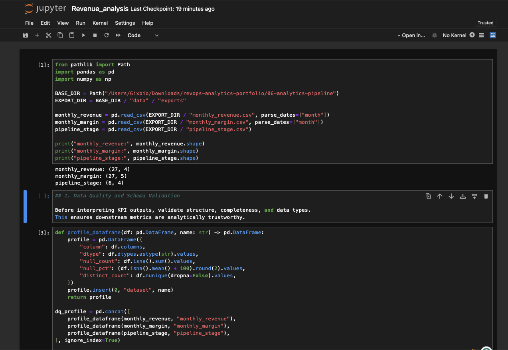
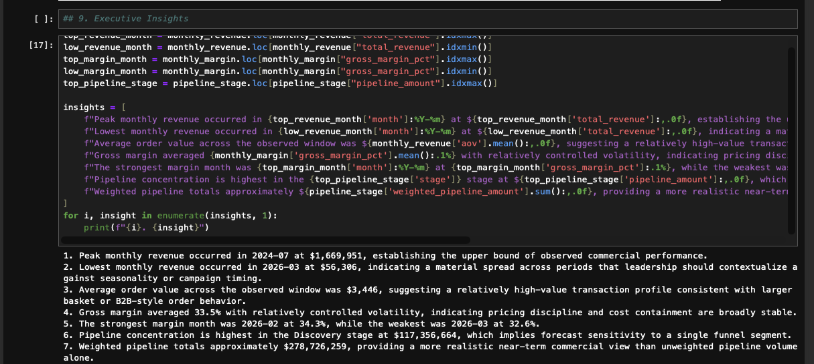

# OmniEdge Professionals — Revenue Intelligence Pipeline

## Overview
This project simulates a full analytics consulting engagement focused on revenue intelligence, KPI engineering, and executive reporting.

The pipeline was designed to demonstrate how raw transactional and commercial data can be transformed into a curated analytics layer that supports leadership decision-making.

## Business Problem
Leadership teams need more than raw operational data. They need a governed analytics workflow that can:

- ingest and validate source files
- standardize and transform core business entities
- load curated data into a warehouse model
- generate KPI marts for revenue, margin, and pipeline
- export business-ready datasets for BI tools
- produce executive-level insight summaries

## Solution Architecture
Source CSVs  
→ ingestion and validation  
→ Python transformation  
→ DuckDB warehouse  
→ KPI output tables  
→ Tableau exports  
→ executive dashboard and analysis notebook

## Technical Stack
- Python
- pandas
- NumPy
- DuckDB
- SQL
- Tableau Public
- Jupyter Notebook

## Pipeline Components

### 1. Ingestion and Validation
Script: `scripts/01_ingest_and_validate.py`

Purpose:
- copies source files into a raw landing zone
- validates file existence
- records row counts, column counts, and duplicates
- writes a validation report to `/logs`

### 2. Transformation and Warehouse Load
Script: `scripts/02_transform_and_load_duckdb.py`

Purpose:
- cleans transactional and commercial data
- standardizes dates and numeric fields
- removes duplicates
- loads curated tables into DuckDB
- builds analytics fact tables for orders, margin, and pipeline

### 3. KPI Output Layer
Script: `scripts/03_build_kpi_outputs.py`

Purpose:
- creates monthly revenue
- creates monthly gross margin
- creates pipeline by stage
- writes processed KPI tables to `/data/processed`

### 4. Tableau Delivery Layer
Script: `scripts/04_export_for_tableau.py`

Purpose:
- moves curated KPI tables into `/data/exports`
- creates BI-ready source files for Tableau dashboards

### 5. Executive Analysis Notebook
Notebook: `notebooks/revenue_analysis.ipynb`

Purpose:
- evaluates revenue, orders, and AOV trends
- measures gross margin stability and tolerance bands
- calculates pipeline concentration and weighted forecast
- produces executive insight statements and exception reporting

## Key Outputs
- `monthly_revenue.csv`
- `monthly_margin.csv`
- `pipeline_stage.csv`
- `executive_insights.csv`
- `analytic_summary.xlsx`

## Example Business Insights
This project supports insights such as:
- highest and lowest revenue months
- average order value behavior over time
- margin performance relative to expected range
- pipeline concentration by stage
- weighted commercial forecast vs raw pipeline

## Why This Matters
This project demonstrates more than dashboarding. It shows the full analytics lifecycle:
- engineering
- modeling
- metric development
- analysis
- executive communication

## Ideal Use Cases
- revenue operations analytics
- executive business intelligence
- decision support reporting
- KPI and performance management
- sales pipeline analytics

## How to Run

### Install dependencies
```bash
pip install -r requirements.txt

python scripts/01_ingest_and_validate.py
python scripts/02_transform_and_load_duckdb.py
python scripts/03_build_kpi_outputs.py
python scripts/04_export_for_tableau.py


## Screenshots

### Executive Dashboard


### Notebook Data Load


### Revenue Trend Analysis


### Margin Analysis


### Pipeline Analysis


### Executive Insights


### DuckDB Validation


## Results

This project produced a fully operational revenue intelligence workflow with:

- validated raw source ingestion
- standardized Python ETL transformations
- DuckDB warehouse fact tables
- monthly KPI outputs for revenue, margin, and sales pipeline
- Tableau-ready export datasets
- executive analysis notebook with business insight generation

## Representative Metrics
- 12,000 orders processed
- 48,042 order line items modeled
- 2,400 opportunities loaded into pipeline analytics
- 27 months of monthly KPI output generated
