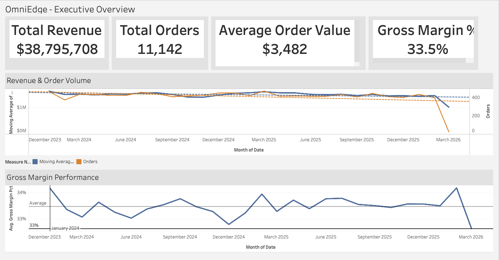
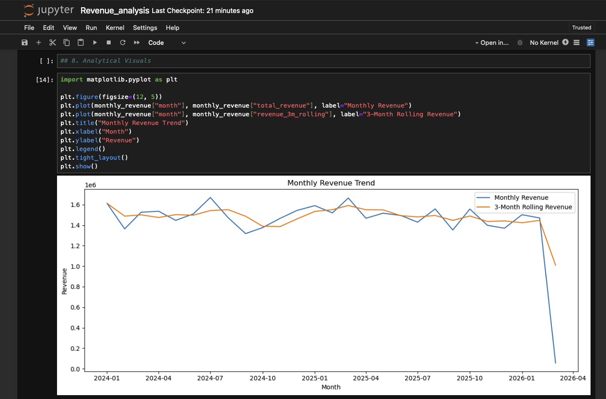
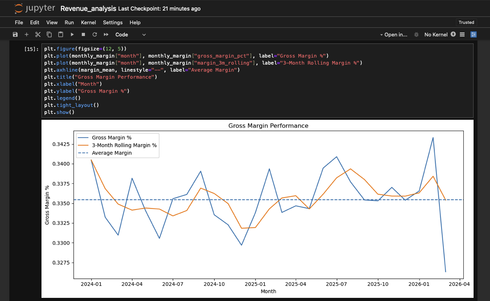
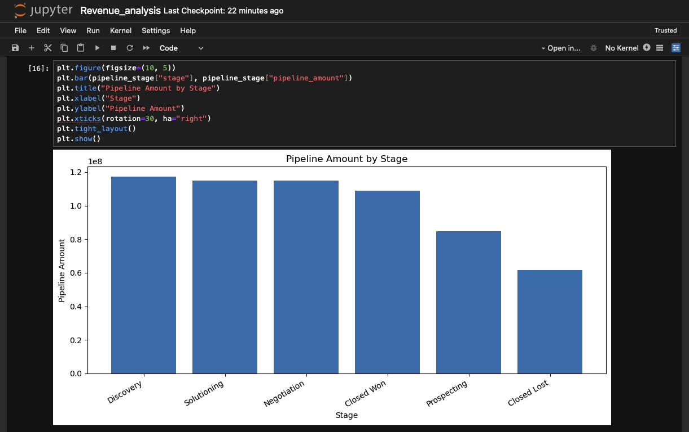
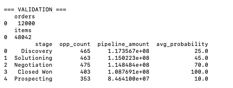

# OmniEdge Revenue Intelligence Pipeline

An end-to-end revenue analytics pipeline built with Python, DuckDB, SQL, and Tableau.
This project simulates a modern Revenue Operations (RevOps) analytics stack, transforming raw operational datasets into executive-level insights and dashboards.
The workflow demonstrates how data flows through a full analytics lifecycle:
Raw Data → ETL Processing → Analytics Warehouse → KPI Data Mart → Dashboard & Insights

## Project Overview

This repository models a complete analytics platform used by revenue operations teams to analyze:

• Revenue performance  
• Gross margin trends  
• Sales pipeline health  
• Order volume and fulfillment  
• Customer activity  
• Operational support metrics  

The architecture mirrors real production analytics environments used by modern data teams.

## Architecture
01-data-generator  
↓  
02-etl-pipeline-python  
↓  
03-warehouse-duckdb / Snowflake  
↓  
04-tableau-public exports  
↓  
06-analytics-pipeline (analysis + insights)

## Technology Stack
Layer | Technology
----- | ----------
Data Generation | Python, Faker
ETL Pipeline | Python, Pandas
Data Quality | Custom validation framework
Data Warehouse | DuckDB / Snowflake compatible SQL
Storage Format | CSV / Parquet
Analytics | Jupyter Notebook
Dashboard | Tableau Public
Version Control | Git / GitHub

## Repository Structure
01-data-generator  
Synthetic dataset generator used to simulate operational systems.

02-etl-pipeline-python  
Python ETL pipeline that extracts, validates, cleans, and transforms raw datasets.

03-snowflake-warehouse  
Snowflake-compatible warehouse schema and setup scripts.

03-warehouse-duckdb  
Local analytics warehouse implementation using DuckDB.

04-tableau-public  
Exports curated executive datasets used by Tableau dashboards.

06-analytics-pipeline  
Executive analytics workflow including notebooks, KPI outputs, and insight generation.

data_out  
Generated operational datasets used throughout the pipeline.

docs  
Supporting documentation and analytics playbooks.

## Executive Dashboard

The final output of the pipeline is an executive-level revenue performance dashboard.

Key KPIs displayed:

• Total Revenue  
• Total Orders  
• Average Order Value  
• Gross Margin %

## Analytical Insights Notebook

The analytics notebook performs deeper analysis on curated datasets produced by the pipeline.

Revenue Trend Analysis

Gross Margin Performance

Sales Pipeline Distribution

## Example Executive Insights Generated

The notebook produces narrative insights similar to what a RevOps team would deliver to leadership:

• Peak monthly revenue occurred in July 2024 at approximately $1.66M  
• Gross margin remained stable around 33.5% across the observed period  
• Pipeline concentration is highest in the Discovery stage  
• Weighted pipeline analysis provides a more realistic near-term forecast compared to raw opportunity totals

These insights simulate real business intelligence reporting used by executive stakeholders.

## Data Quality Validation

Before analytics processing, the pipeline performs schema validation and record consistency checks.

Example warehouse validation output:

## Running the Project
Generate synthetic data

cd 01-data-generator  
python generate_dataset.py

Run the ETL pipeline

cd 02-etl-pipeline-python  
python run_etl.py

Build the analytics warehouse

cd 03-warehouse-duckdb  
python scripts/build_warehouse.py

Export executive datasets

cd 04-tableau-public  
python export_exec_views.py

Launch the analytics notebook

cd 06-analytics-pipeline/notebooks  
jupyter notebook

## Skills Demonstrated

This project demonstrates capabilities across multiple data engineering and analytics domains:

• Data pipeline architecture  
• Python ETL development  
• Data warehouse modeling  
• Revenue analytics and KPI generation  
• Business intelligence dashboarding  
• Executive insight reporting  
• Data quality validation  
• Git version control and project structuring

## Use Cases

This pipeline architecture could support:

• Revenue Operations teams  
• Sales analytics teams  
• Supply chain reporting  
• Business intelligence platforms  
• Executive performance dashboards

## Author

Justynn Hammond - OmniEdge Professionals

Data Analytics • Revenue Intelligence • Analytics Engineering

GitHub  
https://github.com/jhamm2315
